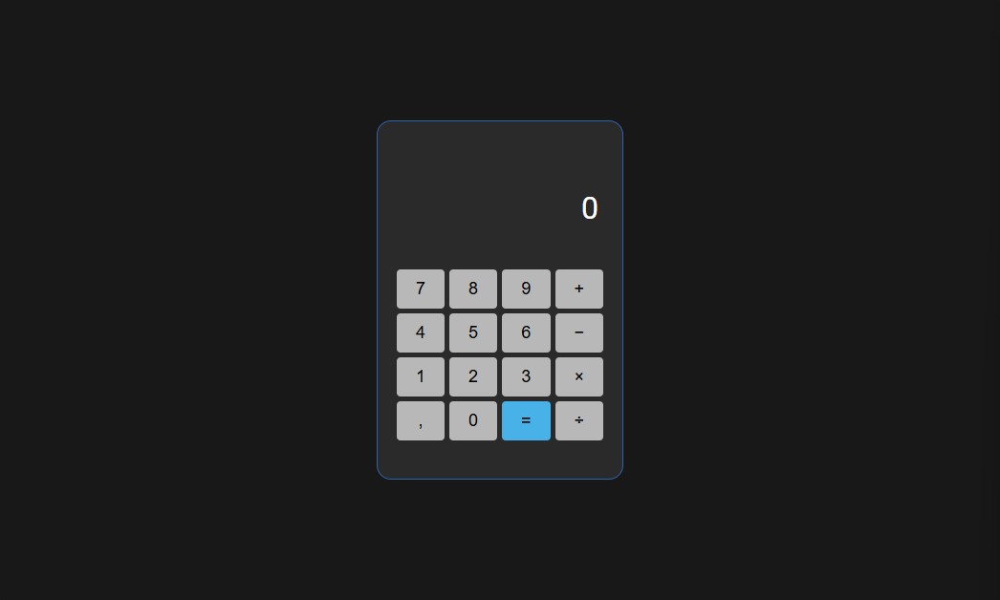

# Projeto Calculadora - Javascript
O projeto está sendo construído afim de pôr em prática os conhecimentos adquiridos de Javascript

[clique aqui para acessar o projeto](https://kaycso.github.io/calculator-js)

## Tecnologias
- HTML
- CSS
- JavaScript

## Necessário adicionar
- Botão para apagar o display (C)
- Botão para apagar número digitado por engano
- Após realizar uma operação, poder fazer outra utilizando o resultado obtido
- Utilizar o teclado para usar a calculadora
- Mudar o operador no histórico caso não tenha sido digitado outro número (atualmente ele deixa os dois operadores ex.: 22+-)